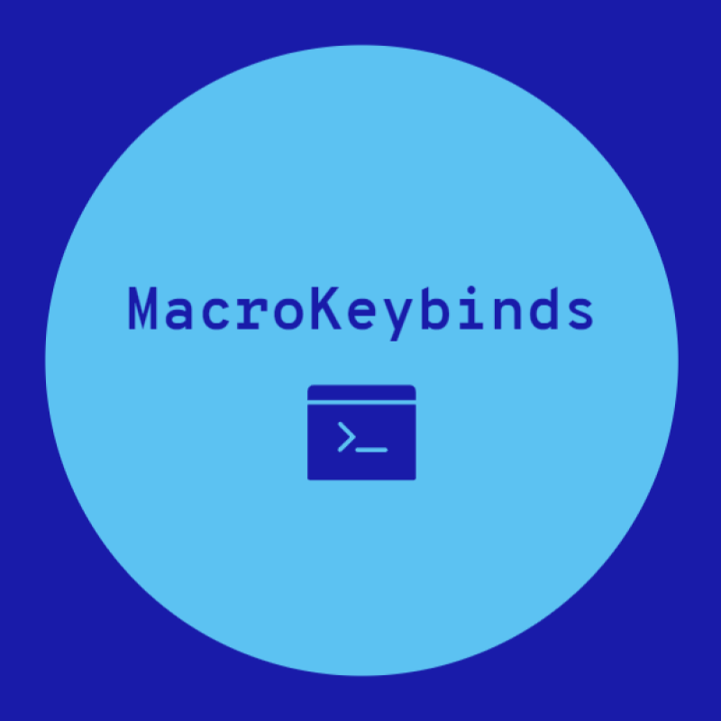
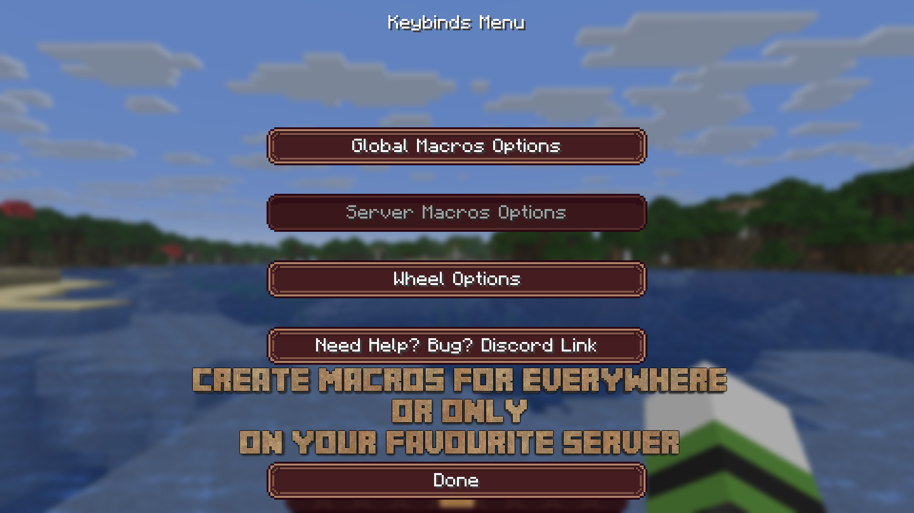
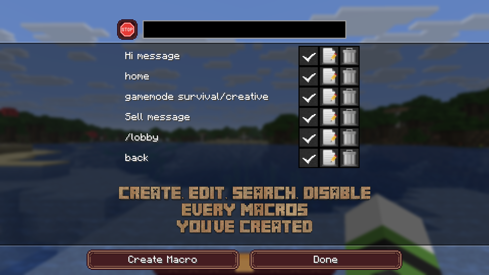
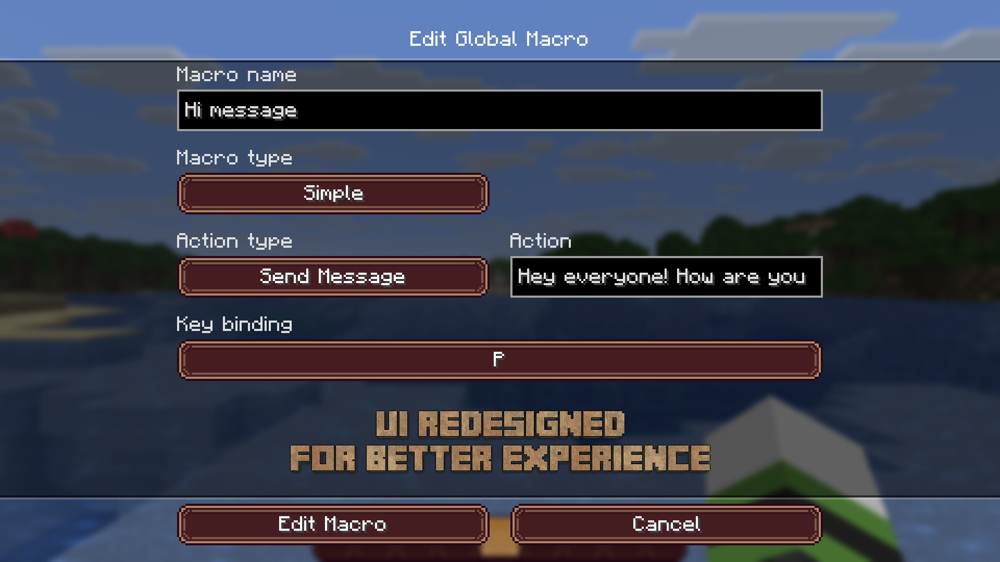
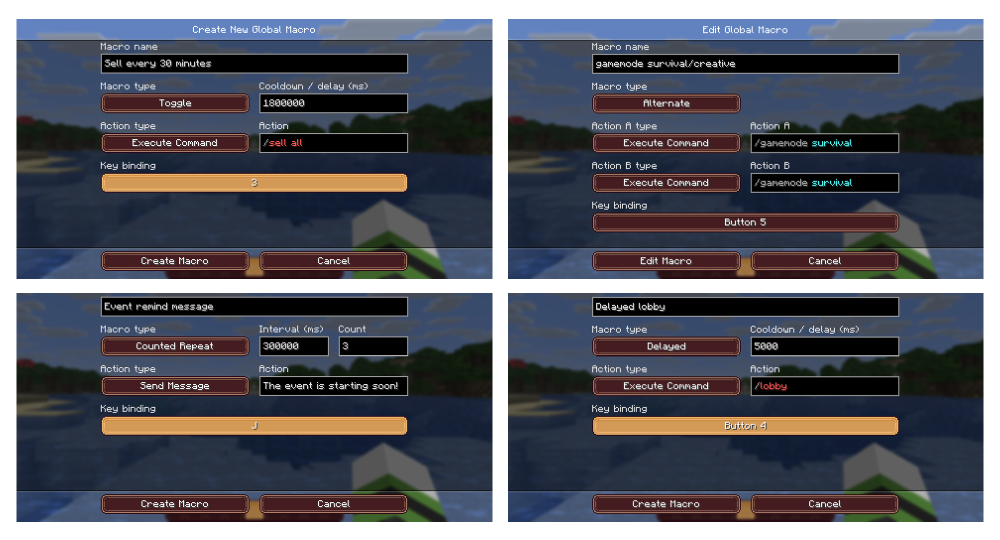
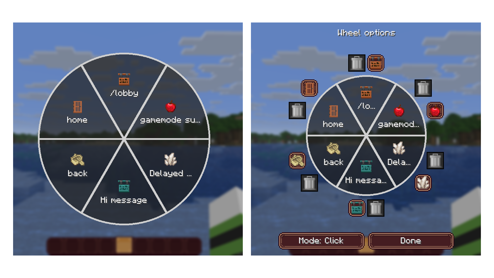

  

Welcome to the Macro Keybinds mod. MacroKeybinds is a mod that allows the user to create macros in order to execute a task faster.

_If you encounter a bug, have a question, a suggestion, join my discord: [https://discord.gg/xTqj3ZSeH4](https://discord.gg/xTqj3ZSeH4)_

**__MacroKeybinds has 4 types of actions:__**

* Execute Command : Executes a Minecraft or server command
* Fill Chat Without Send : Opens the chat and fills it with the selected text without sending it
* Send Message : Sends the selected message in the chat
* Display Local Message : Displays a message in the chat only visible by the client

__**MacroKeybinds has 6 modes:**__

* Simple : One press allows the execution of the macro
* Toggle : One press activates a timer that will run every x time, another press stops it
* Repeat : A long press allows the macro to be executed every x time
* Delayed : Pressing this button activates a timer that will run the macro after x time
* Counted Repeat : One press allows the macro to be executed x times at a selected interval
* Alternate : Each press alternates between two actions

__**Macro Wheel:**__

The macro wheel allows you to quickly access up to 6 global macros. Each slot can have its own Minecraft item icon.

* Click : Open the wheel and click on a macro to execute it
* Hold : Hold the wheel key, move the mouse over a macro and release the key to execute it

**You can create macros that will be available in all servers.**
**However you can create macros for each server, useful when you play on more than one server.**
**You can assign several macros to the same key.**
**You can combine a key with Shift, Control or Alt.**

DOWNLOAD LINK:

https://www.curseforge.com/minecraft/mc-mods/macrokeybinds/files

https://modrinth.com/mod/macrokeybinds/versions

**Be careful! Some servers do not tolerate this type of mod. Make sure you don't get banned for cheating! I won't be held responsible for your actions.**
